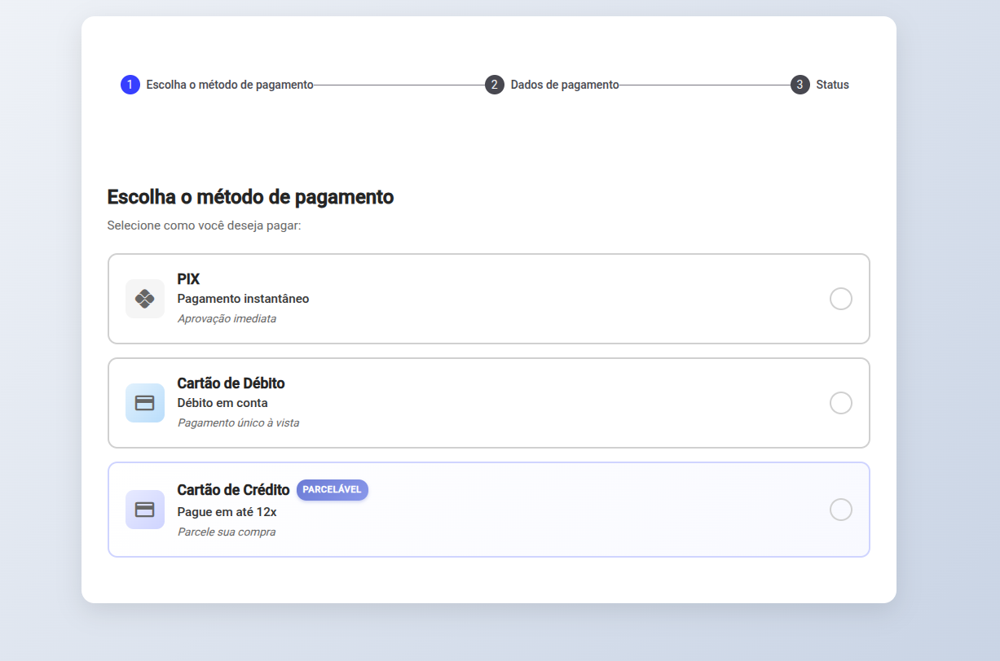

# Payment Card System

Simple Angular payment flow with card and PIX options.



## Preview Links

- [PIX preview](doc/preview-pix.png)
- [Card preview](doc/preview-card.png)
 
  
## Technologies

- Angular
- Angular Material
- TypeScript
- SCSS
- Angular Signals

## Run The Project

Install dependencies:

```bash
npm install
```

Start the development server:

```bash
npm start
```

Open:

```text
http://localhost:4200/
```

## Build

```bash
npm run build
```

## Test

```bash
npm test -- --watch=false 
```  
